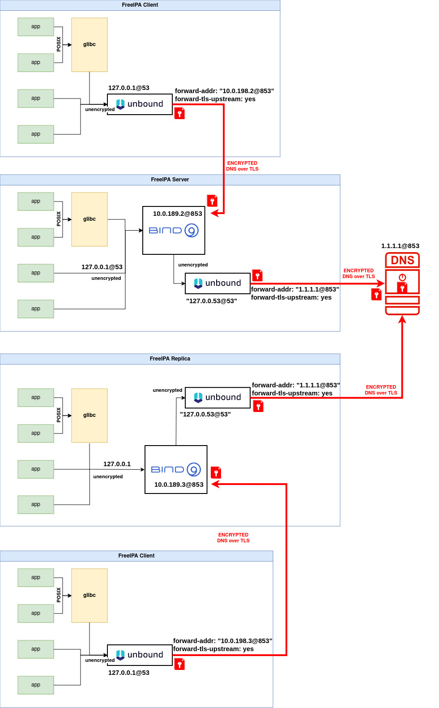

# Encrypted DNS Support

FreeIPA DNS integration allows administrators to manage and serve DNS records in a domain using the same CLI or Web UI as when managing identities and policies. At the same time, administrators can benefit from the tight DNS integration in FreeIPA management framework and have configuration changes in FreeIPA server covered by automatic DNS updates.

## Overview

Encrypted DNS, also known as DNS over HTTPS (DoH) or DNS over TLS (DoT), is a protocol that encrypts DNS queries and responses exchanged between DNS clients (such as web browsers or applications) and DNS servers. Traditional DNS queries are sent over plaintext connections, which can be intercepted and monitored by malicious actors, posing privacy and security risks.

In modern deployments, the internal network can no longer be trusted, it means that all traffic must be authenticated, authorized and encrypted. Encrypted DNS ensures secure communication by enforcing the use of DoT or DoH methods, encrypting all DNS queries and responses. This feature integrates encrypted DNS seamlessly into the FreeIPA management framework, allowing administrators to decide whether the DNS traffic must be encrypted or not.

This design page outlines the implementation of DoT and DoH for the FreeIPA integrated DNS service. By integrating these encrypted DNS protocols, we aim to enhance the security, privacy, and reliability of DNS resolution within the FreeIPA environment.


## Goals
The primary goal is to provide a way to deploy integrated DNS server with the enforcement of using DNS over encrypted channels instead of using standard UDP port 53 with unencrypted communication. This means that DNS clients must talk to DNS servers using DoT or DoH methods that are fully encrypted. The scope for the traffic encryption is for all DNS queries that are leaving the host, while the local communication within the host does not require encryption.

## Use Cases

We aim to support DoT and DoH for Server, Replica, and Client deployments. However the initial version of this feature will only support DoT. The full list of use cases includes:
- Installing IPA Server with integrated DNS service with DoT enabled.
- Installing an IPA Replica with integrated DNS service with DoT enabled.
- Installing an IPA Replica without integrated DNS service with DoT enabled.
- Installing an IPA Client with DoT enabled.
- Installing IPA Server with integrated DNS service with DoH enabled.
- Installing an IPA Replica with integrated DNS service with DoH enabled.
- Installing an IPA Replica without integrated DNS service with DoH enabled.
- Installing an IPA Client with DoH enabled.

### UC1: Client Enrollment

In this use case, we demonstrate how FreeIPA can be deployed with an integrated DNS service that supports DoT. The focus is on a client enrolling in the FreeIPA domain, discovering the FreeIPA server, having its entries added to BIND, and deploying Unbound with DoT enabled to ensure secure communication with the server.

1. Deploy FreeIPA Server with DoT Enabled. Install FreeIPA Server with DNS and DoT.
2. Client Enrollment Process.
    - Discover the FreeIPA Server
    - Client Entry Addition to Bind (named)
    - Deploy Unbound on Client with DoT Enabled

### UC2: 


## Design

Setting up Unbound with support for DoT/DoH is, of course, just one piece of the puzzle. FreeIPA also needs to make use of these protocols, where a typical deployment involves Servers, Replicas, and Clients. The server side poses multiple challenges, with one of the pivotal obstacles residing in the configuration of the DNS service itself.
Henceforth, when we mention the "server side" we are primarily concentrating on the FreeIPA installers and the strategies for disseminating and managing the DNS configuration, as well as deploying the service. The latter aspect will need to accommodate both internal and external DNS services. "Internal" denotes that the server-side and clients (e.g., SSSD, IPA API, etc.) communicate with an internal IPA DNS server through an encrypted channel, with the assumption that the internal DNS server can forward requests to forwarders over an encrypted channel as well. Conversely, "external" implies that the server-side and clients engage with an external DNS server through an encrypted channel.

When FreeIPA is deployed with an “internal” DNS server, it means that FreeIPA operates its own DNS service for the IPA domain, DNS records and forward zones can be established to streamline resolution between IPA hosts and internal network hosts. DNS forwarding is another feature of FreeIPA: for centralized deployments, it's possible to utilize a global forwarder; for distributed setups, per-server forwarders can be configured. As the DNS service is optional, FreeIPA can be also deployed without integrated DNS where FreeIPA uses DNS services provided by an external DNS server. Even if FreeIPA Server is used as a primary DNS server, other external DNS servers can still be used as secondary servers.

The following diagram represents a topology involving FreeIPA Server, Replica and Client:



Note from the diagram that encryption is needed when queries are leaving the machines. When communication happens inside the host only, encryption is not necessary.

FreeIPA currently relies on systemd-resolved as a local cache resolver, which is enabled by default. The new design involves disabling the systemd-resolved service and replacing it with the Unbound service. The client configuration relies exclusively on Unbound, with a DoT forwarder pointing to the DNS server. The FreeIPA server configuration consists of two main components: BIND (named) as an integrated DNS server, accepting both incoming unencrypted queries from localhost and incoming encrypted queries from external traffic, while relying on Unbound for handling outgoing external encrypted traffic. We initially opted for Unbound over systemd-resolved because features such as DoT and DoH are more robust and mature in Unbound. Additionally, proposed changes to Fedora to enhance systemd-resolved were never accepted ([Changes/DNS Over TLS](https://www.fedoraproject.org/wiki/Changes/DNS_Over_TLS), [systemd issue #20801](https://github.com/systemd/systemd/issues/20801), [BZ#1889901](https://bugzilla.redhat.com/show_bug.cgi?id=1889901)).

The FreeIPA replica deployment depends on whether the DNS integrated service is deployed, distinguishing between two use cases: with and without DNS integrated service. A replica with DNS Integrated Service will mimic a client configuration: it will use Unbound with a DoT forwarder pointing to the DNS server. A replica without DNS Integrated Service will mimic a server configuration: it will use BIND for handling incoming unencrypted queries from localhost and encrypted queries from external sources, along with Unbound for outgoing encrypted traffic.

Another important aspect involves the client's ability to execute DNS updates (nsupdate) whenever their IP address changes, thereby keeping their DNS record up-to-date. This communication must also be secured with DoT/DoH. Currently, the client supports nsupdate with TSIG (shared key), GSS-TSIG which relies on GSS-API for obtaining the secret TSIG key, and without authentication. It now needs to support a new deployment using DoT.

Finally, the trust chain is a critical component of setting up a DoT DNS channel as it enables the client to verify the identity of the DNS server and establish a secure and trusted connection for encrypted DNS communication. To enhance flexibility and accommodate varying deployment scenarios, we plan to introduce additional parameters that allow administrators to provide a certificate at FreeIPA installation time by allowing administrator to specify a custom certificate. The new parameter will be optional, giving administrators the choice to either provide a certificate or rely on custodia for certificate auto enrollment if no certificate is provided.

## Implementation

Most changes involve configuration updates. New installation options for encrypted DNS ensure the deployment and activation of DNS services to encrypt all outbound traffic.

Address of our unbound server has to be set in /etc/resolv.conf. /etc/resolv.conf nameserver 127.0.0.1


## How to Use
During the deployment of a FreeIPA server, replica, or client, new options are available to enable DoT support. These options allow administrators to enhance the security of DNS traffic. Here’s how to use the new options:

- Enable DoT: use the `--dns-over-tls` option to enable DoT support during the deployment of clients, servers, or replicas. This option deploys Unbound as a local cache resolver (with /etc/resolv.conf listening on 127.0.0.1) and configures BIND on the server to receive DoT requests. On the client side, only Unbound will be deployed (with /etc/resolv.conf listening on 127.0.0.53). Replica deployment configuration will depend on whether the Integrated DNS service is deployed. If it is, the same server configuration will apply. If the Integrated DNS server is not deployed, the client configuration will apply.

- Specify an Upstream DNS Server with DoT enabled: use the `--dot-forwarder` option to specify the upstream DNS server that supports DoT. The format must be 1.2.3.4#dns.server.test. You still need to specify at least one of --forwarder, --auto-forwarders, or --no-forwarders options for the non-encrypted communication, discovery process, etc..

- DoT Certificates. If you prefer to use a self-generated certificate for DoT in BIND/Unbound, use the `--dns-over-tls-key` and `--dns-over-tls-cert` options. If these options are not specified, the IPA CA will be used to request a new certificate.


## Feature Management

### UI

TBD.

### CLI

Overview of the CLI commands for the FreeIPA installers and FreeIPA DNS installers:

Configuring DNS services using ipa-dns-install follows the same principles as installing DNS with the ipa-server-install utility.


| Option | Description                                       |
|:------------------------ | :------------------------------ |
|    --dns-over-tls | enable DNS over TLS support. This option is present on both client and server. It deploys Unbound and configures BIND on the server to receive DoT requests. |
    --dot-forwarder | the upstream DNS server with DoT support. It must be specified in the format 1.2.3.4#dns.server.test |
    --dns-over-tls-key and --dns-over-tls-cert | in case user prefers to have the DoT certificate in BIND generated by themselves. If these are empty, IPA CA is used instead to request a new certificate. |


### Configuration

Although installers will deploy a valid Unbound configuration, administrators can easily update/tweak it at /etc/unbound/conf.d/zzz-ipa.conf.


## Upgrade
The following use cases must be covered by the feature implementation:

### UC1: Upgrade and Enable DoT
The implementation must handle upgrade procedure by disabling systemd-resolved in favor of Unbound, and configure Bind (named) to accept incoming encrypted queries.

### UC2: Upgrade without Enabling DoT
The implementation must handle upgrade procedure by disabling systemd-resolved in favor of Unbound, and configure Bind (named).


## Test plan

TBD. PRCI impact, FreeIPA DNS test suites impact. 

### Test Cases:

- TC1: Verify that the new eDNS options are visible and accessible in the ipa CLI. Test basic functionalities of the new eDNS options, such as setting and updating DNS configurations.
- TC2: Setting up IPA Server with the --dns-over-tls option. Ensure that the server setup process completes successfully without errors related to eDNS configurations. 
- TC3. Setting up IPA Server with the --dns-over-tls-cert option with a valid certificate. Ensure that the server setup process completes successfully without errors related to eDNS configurations
- TC4. Setting up IPA Server with the --dns-over-tls-cert option with an invalid certificate. Ensure that errors are reported when an invalid certificate is specified. 
- TC5. Setting up IPA replica with the --dns-over-tls option. Ensure that the server setup process completes successfully without errors related to eDNS configurations.
- TC6. Setting up IPA replica with the --dns-over-tls-cert option with a valid certificate. Ensure that the server setup process completes successfully without errors related to eDNS configurations.
- TC7. Setting up IPA replica with the --dns-over-tls-cert option with an invalid certificate. Ensure that errors are reported when an invalid certificate is specified.
- TC8. Setting up IPA client with the --dns-over-tls option. Ensure that the IPA client setup process completes successfully without errors related to eDNS configurations and validate its connectivity to the server 
- TC9. Testing DNS Traffic Encryption. Send DNS queries and analyze the traffic to confirm that DNS communication is encrypted when using the eDNS options. Verbosity can be increased in Unbound logs to show individual queries and indicate whether they are encrypted (using port 853).
- TC10. Executing existing upstream and downstream DNS Tests with eDNS Options:
    - Run existing upstream and downstream DNS tests on the IPA server replica with eDNS options (--dns-over-tls and --dns-over-tls-cert) enabled.
    - Validate that the tests pass as expected and that the eDNS configurations do not interfere with the existing functionalities. 
- TC11. Configure the IPA server/replica/client with --dns-over-tls or --dns-over-tls-cert without --setup-dns. Verify that the system rejects these configurations and provides meaningful error messages. 
- TC12. Configure the IPA server/replica with a mismatched TLS certificate (eg: incorrect subject name, expired certificate, etc..) for --dns-over-tls-cert connections. Verify that the server/replica detects the certificate mismatch and refuses to establish insecure connections. 

## Troubleshooting and debugging

No DNS Resolution: 
- Ensure that the DNS server (BIND or Unbound) is running.
- Verify that the DNS server is listening on the correct IP addresses and ports.
- Check the firewall settings to ensure that traffic on port 53 and port 853 is allowed.

Encryption Not Working: 
- Verify that forward-tls-upstream is enabled in Unbound.
- Ensure that tls-cert-bundle or tls-system-cert is correctly configured and accessible.
- Restart the Unbound service after making changes.

Logs Not Showing Detailed Information:
- Increase the verbosity level of logging in the configuration files for both BIND and Unbound.
- Restart the respective services to apply the new logging levels.
- Check the log files for detailed debug information.


### Testing and Debugging Unbound

To test the resolution from Unbound using the unbound-host standalone utility you want to use:

`# unbound-host -C /etc/unbound/conf.d/tls-client.conf example.org`

Then you can go through some configuration checks: ensure that Unbound is configured to use DoT automatically. Check if forward-tls-upstream was enabled and that either tls-cert-bundle or tls-system-cert was used during deployment time, as encryption will not be enabled otherwise. After making changes to the Unbound configuration, restart the Unbound daemon by running:

`# systemctl restart unbound`

Alternatively you can also use bind-utils to verify that resolution works through Unbound:

`# dig @localhost example.org`

For a very basic test of Unbound  using OpenSSL:

`# openssl s_client -connect [::1]:853 -verify_hostname unbound < /dev/null`

Output example:

```
CONNECTED(00000003)
Can't use SSL_get_servername
depth=0 CN = unbound
verify error:num=18:self-signed certificate
verify return:1
depth=0 CN = unbound
verify return:1
---
Certificate chain
 0 s:CN = unbound
   i:CN = unbound
   a:PKEY: rsaEncryption, 3072 (bit); sigalg: RSA-SHA256
   v:NotBefore: Jul 13 18:09:50 2023 GMT; NotAfter: Mar 30 18:09:50 2043 GMT
---
```

### Monitoring Traffic with tcpdump and Wireshark

To watch DNS requests and ensure they are encrypted you can easily use tcpdump to capture traffic on port 53 and port 853:
`# tcpdump -n port 53 or port 853`

Alternatively you can rely on Wireshark for more detailed analysis where:
- Port 53 queries should be visible and decodable.
- Port 853 queries or answers should be encrypted and not decodable.

### Testing and Debugging BIND

Verify that the BIND service is running correctly:

`# systemctl status named`

You can run check tool to verify the BIND configuration:

`# named-checkconf /etc/named.conf`

### Increasing logging verbosity

You can always increase the BIND logging verbosity to debug issues. Edit the BIND configuration file to increase logging levels:

```
logging {
    channel default_debug {
        file "data/named.run";
        severity dynamic;
    };
    category default { default_debug; };
};
```
Restart BIND to apply the changes:
`# systemctl restart named`

and monitor the logs for detailed output:

`# tail -f /var/named/data/named.run`


For Unbound edit /etc/unbound/unbound.conf or create a specific logging configuration file (e.g., /etc/unbound/conf.d/logging.conf):

```
server:
    verbosity: 3
```

Restart Unbound to apply the changes:
`# systemctl restart unbound`

and monitor the Unbound logs for detailed output:

`# tail -f /var/log/unbound/unbound.log`

### Debugging Client-Side or nsupdate Issues

To test nsupdate and ensure that DNS updates are functioning correctly you can increase the verbosity of nsupdate logs for detailed debugging when running an update, you want to provide DoT options:

`# nsupdate -A tlscafile -E tlscertfile -H tlshostname -K tlskeyfile -d -v`


