# ipacta -- Comprehensive Documentation

ipacta is FreeIPA's Python-native Certificate Authority, designed as a
drop-in replacement for the Java-based Dogtag PKI. It provides certificate
issuance, revocation, CRL generation, OCSP responses, ACME support, and
key escrow -- all running as a lightweight systemd service with LDAP as
its sole persistent store.

**Table of Contents**

1. [Introduction](#introduction)
2. [Architecture Overview](#architecture-overview)
3. [Process Isolation and Security Model](#process-isolation-and-security-model)
4. [Certificate Issuance Workflow](#certificate-issuance-workflow)
5. [Certificate Lifecycle Management](#certificate-lifecycle-management)
6. [CRL and OCSP](#crl-and-ocsp)
7. [ACME Server](#acme-server)
8. [Profile System](#profile-system)
9. [Sub-CA (Lightweight CA) Management](#sub-ca-lightweight-ca-management)
10. [Security Features](#security-features)
11. [Installation and Deployment](#installation-and-deployment)
12. [Storage Architecture](#storage-architecture)
13. [FreeIPA Integration Points](#freeipa-integration-points)
14. [Use Cases](#use-cases)

---

## Introduction

### Why ipacta?

FreeIPA historically depends on Dogtag PKI, a full-featured Java-based CA
with a large memory footprint, complex configuration, and a dependency
chain that includes Tomcat and the full Java runtime. ipacta replaces
Dogtag with a Python implementation that:

- **Eliminates the Java dependency.** No JVM, no Tomcat, no Java
  cryptography providers. The entire CA runs in a single Python process
  under Gunicorn.
- **Uses LDAP as the single source of truth.** Certificates, CRLs,
  profiles, ACME state, serial ranges, and KRA vaults are all stored in
  389 Directory Server under `o=ipaca`, the same LDAP suffix Dogtag uses.
- **Maintains Dogtag REST API compatibility.** The IPA framework
  (`ipaserver/plugins/dogtag.py`) talks to ipacta through the same
  HTTPS REST API it used with Dogtag, so no changes are needed to the
  IPA CLI or Web UI.
- **Enforces process isolation.** The CA private key never leaves the
  `ipacta.service` process (running as the `ipaca` user). Apache httpd
  communicates via HTTPS with TLS client certificate authentication.

### Design Goals

| Goal | How |
|------|-----|
| Drop-in Dogtag replacement | Same REST API, same LDAP schema, same certificate format |
| Minimal footprint | Python + Gunicorn, ~50 MB RSS vs ~500+ MB for Dogtag/Tomcat |
| Security by default | Process isolation, signed audit logs, HSM support, rate limiting |
| LDAP-native | No local files for state (keys and config excepted) |
| Standards compliance | X.509v3, RFC 5280 (CRL), RFC 6960 (OCSP), RFC 8555 (ACME) |

### Module Map

```
ipacta/
    __init__.py              Global config singleton
    config.py                IpactaConfig (unified configuration)
    ca.py                    PythonCA -- core signing engine
    ca_internal.py           InternalCA -- audit + principal tracking
    backend.py               PythonCABackend -- Dogtag-compatible interface
    wsgi.py                  WSGI application entry point
    gunicorn_conf.py         Gunicorn hooks (post_fork, sd_notify)

    certificate/
        types.py             CertificateStatus, RevocationReason, CertificateRecord
        lifecycle.py         State machine (CertificateLifecycle)
        reload_manager.py    Certificate reload on renewal

    profile/
        __init__.py          Profile data model (Profile, PolicyRule,
                              Constraint, Default dataclasses)
        parser.py            ProfileParser (Java .cfg format)
        manager.py           ProfileManager (LDAP + filesystem)
        monitor.py           LDAP change detection (entryUSN polling)
        defaults.py          Profile default generators
        constraints.py       Profile constraint validators

    rest_api/
        __init__.py          Flask blueprint registration
        _helpers.py          Authentication (SSL_CLIENT_VERIFY, agent auth)
        ca_core.py           /pki/rest/info, /ca/rest/info,
                              /ca/admin/ca/getStatus, /ca/rest/account/*,
                              /ca/rest/securityDomain/domainInfo
        certs.py             /ca/rest/certrequests, /ca/rest/agent/certs,
                              /ca/rest/certs
        crl_ocsp.py          /ca/ee/ca/getCRL, /ca/ocsp
        acme.py              /acme/* endpoints
        authorities.py       /ca/rest/authorities (sub-CAs)
        profiles.py          /ca/rest/profiles
        kra.py               /ca/rest/agent/keys
        hsm.py               /ca/rest/hsm
        debug.py             /ca/rest/debug/resources, /ca/rest/debug/gc
                              (resource tracking)
        ranges.py            /ca/rest/ranges

    storage/
        base.py              LDAP connection pool, base DN management
        factory.py           get_storage_backend() factory function
        certificates.py      Certificate storage
        ca.py                CA configuration storage
        crl.py               CRL storage
        subca.py             Sub-CA storage
        profiles.py          Profile storage
        acme.py              ACME state storage
        kra.py               KRA vault storage
        ranges.py            Serial range storage
        hsm.py               HSM configuration storage
        maintenance.py       Maintenance/cleanup storage

    install/
        __init__.py          Exports composition helpers
        _utils.py            _InstallLDAPMod mixin
        db.py                NSSDB helper
        certs.py             Certificate generation (CA, OCSP, audit, ...)
        ldap_setup.py        LDAP schema creation
        service_mgmt.py      systemd service management
        replica.py           Replication setup
        kra.py               KRA installation
        acme.py              ACME LDAP schema
        lwca.py              Lightweight CA setup

    acme.py                  ACMEServer (RFC 8555 protocol)
    acme_state.py            ACMEStateManager (enable/disable)
    jwk.py                   JWK / JWS support
    ocsp.py                  OCSPResponder
    audit.py                 AuditLogger (signed, hash-chained)
    hsm.py                   HSM integration (PKCS#11)
    key_encryption.py        AES-256-GCM key encryption
    key_escrow.py            Key escrow backend
    kra.py                   Key Recovery Authority
    pruning.py               CRL pruning
    nss_utils.py             NSS database utilities
    ldap_utils.py            LDAP connection utilities
    x509_utils.py            X.509 crypto utilities
    rate_limit.py            Per-IP sliding-window rate limiters
    resource_tracker.py      Memory/resource monitoring
    exceptions.py            Exception hierarchy
```

---

## Architecture Overview

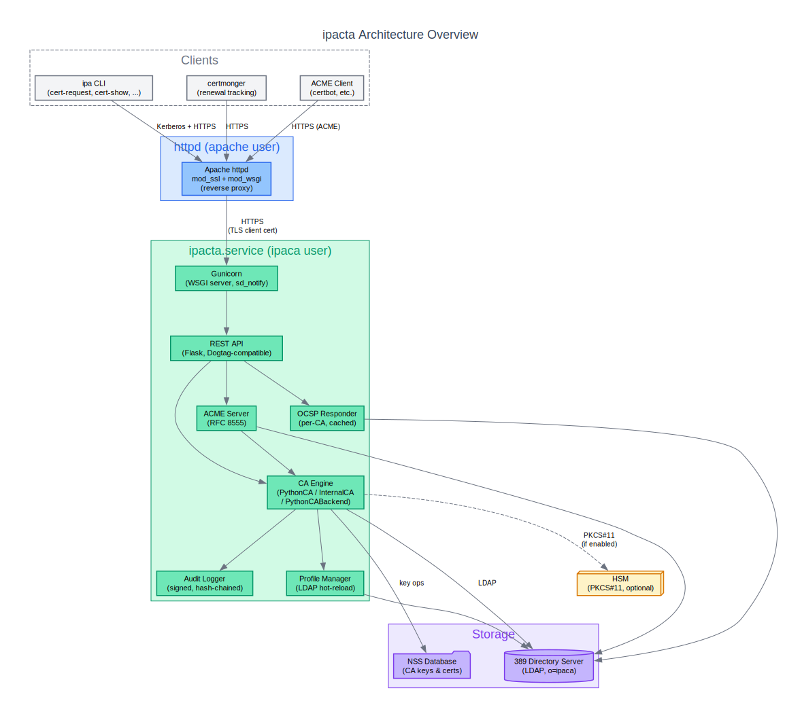

ipacta is structured as three concentric layers, each adding
capabilities on top of the previous one:

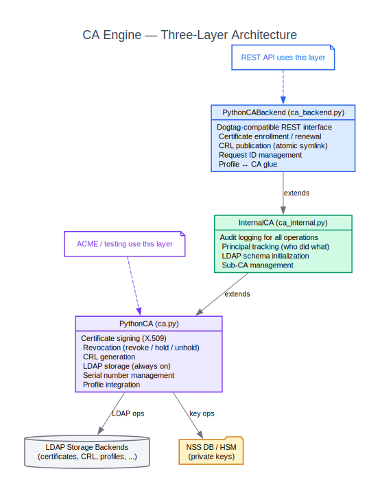

### PythonCA (`ca.py`) -- Core Engine

The minimal CA kernel. Handles:

- Certificate signing using the `cryptography` library.
- Revocation (revoke, hold, unhold) with RFC 5280 reason codes.
- CRL generation with lightweight revoked-certificate iteration.
- LDAP storage (always enabled -- not optional).
- Serial number management (sequential or random).
- Profile integration for policy enforcement.

Used directly by ACME, testing, and migration tools where audit
logging is not needed.

### InternalCA (`ca_internal.py`) -- Production Layer

Extends PythonCA with enterprise features:

- **Audit logging** for every signing, revocation, and CRL operation
  via `AuditLogger`.
- **Principal tracking** -- every operation records who performed it
  (the Kerberos principal or RA agent DN).
- **LDAP schema initialization** (`initialize_schema()`).

This is the CA used by the production REST API.

### PythonCABackend (`backend.py`) -- Dogtag-Compatible Interface

The outermost layer, consumed by the REST API. Provides:

- Dogtag-compatible certificate enrollment and renewal.
- CRL publication with atomic symlink.
- Request ID management (Dogtag request format).
- Profile-to-CA glue (profile lookup, validation, signing).
- ACME server instantiation and state management.

### Gunicorn Process Model

ipacta runs under Gunicorn as a WSGI application:

- **`post_fork` hook:** Each worker reinitializes the LDAP connection
  pool, reopens log file handles, and starts the rate-limiter purge
  thread.
- **`when_ready` hook:** The Gunicorn arbiter sends `sd_notify
  READY=1` to systemd, signaling that the service is accepting
  connections.
- **`worker_exit` hook:** Cleans up worker-local resources.

The systemd unit uses `Type=notify` with `NotifyAccess=main`, so the
service is not considered started until Gunicorn reports readiness.

---

## Process Isolation and Security Model

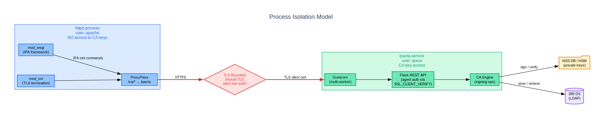

### Two-Process Architecture

ipacta enforces a strict security boundary between the web-facing
process and the CA signing process:

| Process | User | Role | Key Access |
|---------|------|------|------------|
| `httpd` | `apache` | TLS termination, Kerberos auth, IPA framework, reverse proxy | **None** -- never loads CA modules |
| `ipacta.service` | `ipaca` | CA operations, signing, REST API | Full access to NSS DB and HSM |

Apache httpd proxies `/ca/*` requests to the ipacta Gunicorn
instance over HTTPS. The proxy connection uses TLS with client
certificate authentication -- httpd presents the RA agent certificate
to identify itself.

### Authentication Model

The REST API authenticates callers via the WSGI environment variable
`SSL_CLIENT_VERIFY`, populated by mod_ssl from the TLS handshake.
This is set by the web server itself, not from HTTP headers, which
prevents header-injection attacks.

Two authentication levels:

- **Client certificate authentication** -- any valid client cert
  (used for read-only endpoints like certificate retrieval).
- **Agent authentication** (`@require_agent_auth`) -- the client
  certificate must belong to an RA agent. Required for all mutating
  operations (certificate signing, revocation, profile changes, CRL
  generation, ACME enable/disable, HSM configuration).

There is no localhost trust bypass -- all requests must present a
valid TLS client certificate regardless of origin.

### Rate Limiting

Per-IP sliding-window rate limiters protect against abuse:

| Endpoint | Limit | Window |
|----------|-------|--------|
| `new-account` (ACME) | 20 | 1 hour |
| `new-order` (ACME) | 60 | 1 minute |
| `revoke-cert` (ACME) | 10 | 1 minute |
| OCSP | 600 | 1 minute |
| All other ACME POST endpoints | 120 | 1 minute |

Exceeded limits return HTTP 429 with a `Retry-After` header. The 120/min
"all other ACME POST" limit (`rate_limit.acme_general`) is applied only
within the ACME blueprint (`rest_api/acme.py`), to endpoints such as
challenge validation and order finalization. Non-ACME REST endpoints
(`rest_api/ca_core.py`, `rest_api/certs.py`) have no rate limiting at
all.

---

## Certificate Issuance Workflow

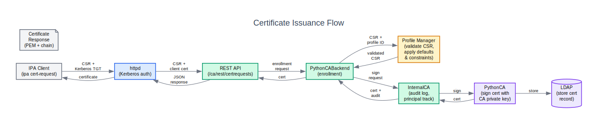

### End-to-End Flow

1. **Client request.** The IPA client (e.g. `ipa cert-request`)
   submits a CSR with a Kerberos TGT.

2. **httpd authentication.** Apache httpd validates the Kerberos
   ticket and forwards the request to the IPA framework running
   under mod_wsgi.

3. **IPA framework processing.** The `cert-request` plugin in
   `ipaserver/plugins/dogtag.py` performs authorization checks
   (permissions, ACIs) and proxies the request to ipacta via
   HTTPS with the RA agent certificate.

4. **REST API reception.** The Flask REST API at
   `/ca/rest/certrequests` receives the enrollment request and
   verifies agent authentication.

5. **Profile selection.** `PythonCABackend` looks up the requested
   profile (default: `caIPAserviceCert`) from the `ProfileManager`.

6. **CSR validation.** The profile's constraint chain validates the
   CSR: allowed key sizes, required extensions, permitted subject
   patterns, and signing algorithms.

7. **Default application.** The profile's default chain populates
   certificate fields: validity period, key usage, extended key
   usage, CRL distribution points, AIA, and other extensions.

8. **Signing.** `InternalCA` signs the certificate with the CA
   private key (from NSS DB or HSM) and logs the operation to the
   audit log with the requesting principal.

9. **Storage.** The signed certificate is stored in LDAP under
   `ou=certificateRepository,ou=ca,o=ipaca`.

10. **Response.** The certificate is returned as PEM with the full
    CA chain through the REST API, httpd proxy, and back to the
    client.

---

## Certificate Lifecycle Management

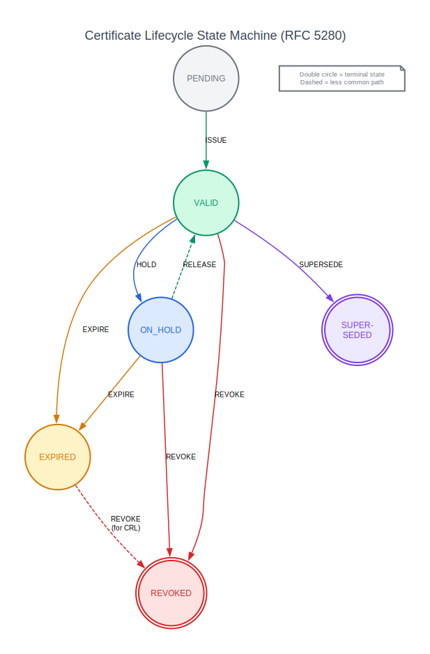

### State Machine

ipacta implements an RFC 5280-compliant certificate lifecycle state
machine in `certificate/lifecycle.py`. Every certificate tracks its
current state and maintains a complete audit trail of state
transitions.

**States:**

| State | Description | Terminal? |
|-------|-------------|-----------|
| `PENDING` | Request submitted, not yet issued | No |
| `VALID` | Active certificate | No |
| `EXPIRED` | Past `notAfter` date | No |
| `ON_HOLD` | Temporarily suspended (certificate hold) | No |
| `REVOKED` | Permanently revoked | Yes |
| `SUPERSEDED` | Replaced by a newer certificate | Yes |

**Transitions:**

| From | Event | To | Notes |
|------|-------|----|-------|
| PENDING | ISSUE | VALID | Certificate signed and issued |
| VALID | EXPIRE | EXPIRED | `notAfter` date exceeded |
| VALID | REVOKE | REVOKED | Permanent revocation |
| VALID | HOLD | ON_HOLD | Temporary suspension |
| VALID | SUPERSEDE | SUPERSEDED | Replaced by renewal |
| ON_HOLD | RELEASE | VALID | Released from hold (reversible) |
| ON_HOLD | REVOKE | REVOKED | Held cert permanently revoked |
| ON_HOLD | EXPIRE | EXPIRED | Held cert expires |
| EXPIRED | REVOKE | REVOKED | Revoke expired cert for CRL inclusion |

Each transition records: from/to states, event, timestamp, principal,
reason, and serial number.

### Revocation

When a certificate is revoked:

1. The lifecycle state machine validates the transition.
2. The certificate record is updated in LDAP with the revocation
   reason (RFC 5280 reason codes: keyCompromise, CACompromise,
   affiliationChanged, superseded, cessationOfOperation,
   certificateHold, privilegeWithdrawn, AACompromise).
3. The OCSP cache is invalidated for that serial number
   (`_invalidate_ocsp_cache()`), so the next OCSP query returns the
   current status immediately.
4. The audit logger records the revocation with principal and reason.

### Certificate Hold (Temporary Revocation)

`ON_HOLD` is the only reversible revocation state. A certificate
placed on hold:

- Appears as revoked in OCSP responses (reason: `certificateHold`).
- Is included in CRLs with the `certificateHold` reason.
- Can be released back to `VALID` via the `RELEASE` event, which
  removes it from the next CRL and clears the OCSP revocation status.

---

## CRL and OCSP

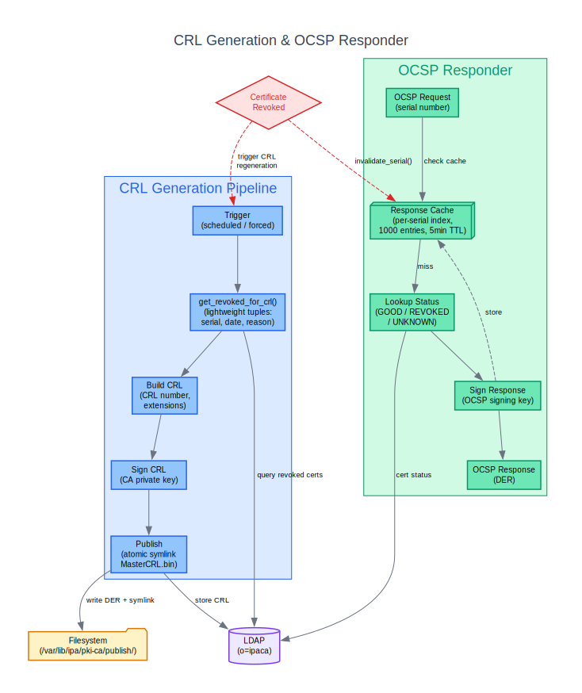

### CRL Generation

CRL generation is handled by `PythonCA.generate_crl()`:

1. **Next CRL number.** Retrieved from LDAP (monotonically
   incrementing).
2. **Revoked certificates.** `get_revoked_for_crl()` returns a
   generator of lightweight `(serial_number, revoked_at,
   reason_int)` tuples -- the full certificate DER is never loaded,
   keeping memory usage constant regardless of CRL size.
3. **CRL construction.** Issuer from CA certificate, `lastUpdate` =
   now, `nextUpdate` = now + interval + grace period, CRL Number
   and Authority Key Identifier extensions.
4. **Signing.** The CRL is signed with the CA's private key.
5. **Storage.** Stored in LDAP under
   `ou=crlIssuingPoints,ou=ca,o=ipaca`.
6. **Publication.** `PythonCABackend.update_crl()` writes the
   DER-encoded CRL to the filesystem and creates an atomic symlink
   `MasterCRL.bin` (temp symlink + rename) in the publish directory.
   Apache serves this at the CRL Distribution Point URL
   (`http://ipa-ca.{domain}/ipa/crl/MasterCRL.bin`).

**CRL scheduling:**

| Parameter | Default | Description |
|-----------|---------|-------------|
| `crl_update_interval` | 240 min (4 hours) | Update interval |
| `crl_enable_daily_updates` | `true` | Enable daily scheduled updates |
| `crl_daily_update_time` | `01:00` | Daily update time |
| `crl_next_update_grace_period` | `0` | Grace period on `nextUpdate` |
| `crl_include_expired_certs` | `false` | Include expired certs in CRL |

### OCSP Responder

The OCSP responder (`ocsp.py`) provides real-time certificate status
per RFC 6960:

- **Dedicated signing key.** OCSP responses are signed with a
  separate OCSP signing certificate (not the CA key), following
  best practice for OCSP responder delegation.
- **Per-CA instances.** `OCSPResponderManager` maintains one
  responder per CA/sub-CA, created on demand.
- **Response caching.** A bounded `cachetools.TTLCache` (1000 entries,
  5-minute TTL) caches responses keyed on
  `SHA256("{serial}:{nonce_hex}")`.
- **Per-serial invalidation.** A secondary index
  (`_serial_to_keys`) maps serial numbers to cache keys, enabling
  O(1) cache invalidation when a certificate is revoked -- no full
  cache scan needed.
- **Nonce support.** If the OCSP request contains a nonce extension,
  it is echoed back in the response for replay protection.

**REST endpoints:**

- `POST /ca/ocsp` -- DER-encoded OCSP request.
- `GET /ca/ocsp/{base64_request}` -- URL-encoded request (max 8192
  bytes).
- `POST /ca/ee/ca/ocsp` -- Legacy Dogtag-compatible endpoint.

---

## ACME Server

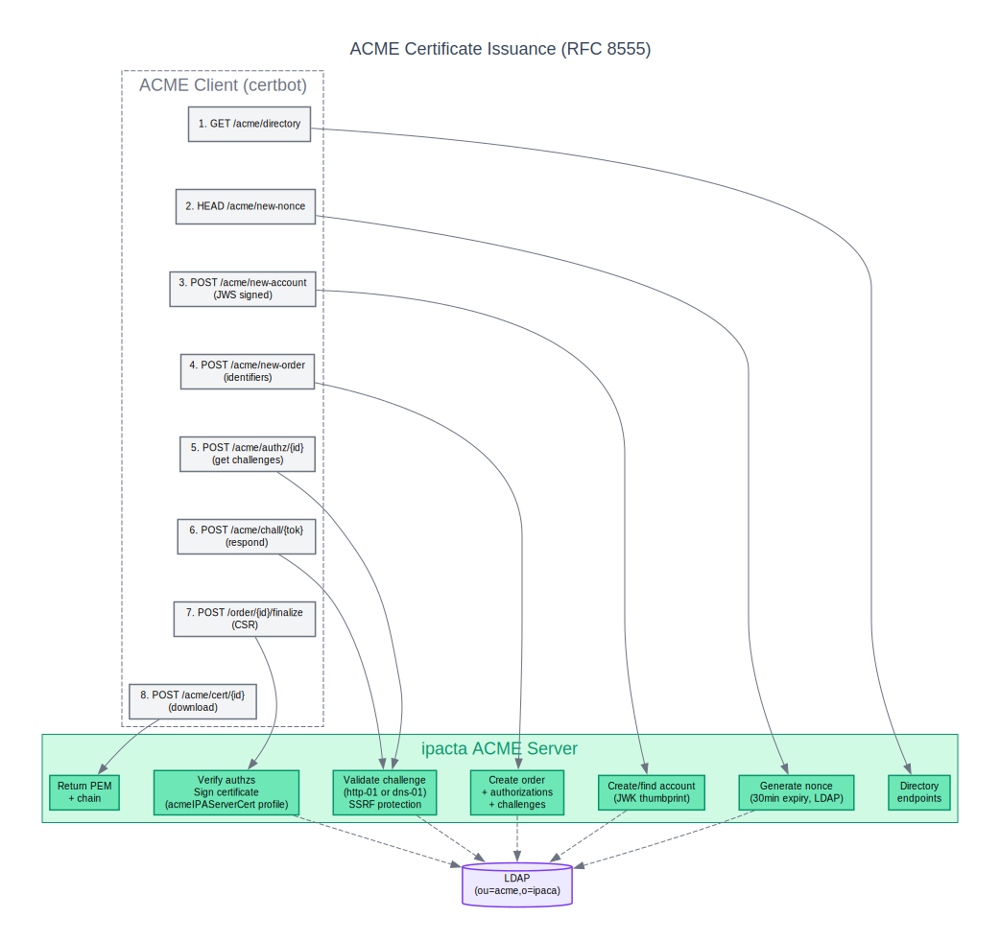

ipacta includes a full RFC 8555 ACME server for automated
certificate issuance. The implementation consists of `ACMEServer`
(protocol logic), `ACMEStateManager` (enable/disable), and `JWK`
(JSON Web Key support).

### Order Lifecycle

The standard ACME flow:

1. **Directory discovery.** Client fetches `GET /acme/directory` to
   learn endpoint URLs.
2. **Nonce acquisition.** `HEAD /acme/new-nonce` returns a
   `Replay-Nonce` header. Nonces are stored in LDAP with a
   30-minute expiration and consumed on use (one-time).
3. **Account creation.** `POST /acme/new-account` with a JWS-signed
   request. The account ID is derived from the JWK thumbprint
   (SHA-256). Supports `onlyReturnExisting` (RFC 8555 section
   7.3.1).
4. **Order creation.** `POST /acme/new-order` with DNS identifiers.
   Creates authorizations with `http-01` and `dns-01` challenges.
   Orders expire after 24 hours.
5. **Challenge validation.** Client responds to a challenge; the
   server validates with retry logic (3 attempts):
   - **http-01:** Fetches
     `http://{identifier}/.well-known/acme-challenge/{token}` and
     verifies the response matches `{token}.{thumbprint}`.
   - **dns-01:** Resolves `_acme-challenge.{identifier}` TXT record
     and verifies it matches
     `base64url(SHA256({token}.{thumbprint}))`.
6. **Finalization.** `POST /order/{id}/finalize` with a DER-encoded
   CSR. The server verifies all authorizations are valid, validates
   SANs match identifiers, and signs with the `acmeIPAServerCert`
   profile.
7. **Certificate download.** `POST /acme/cert/{id}` returns the PEM
   certificate with full chain.

### SSRF Protection

Before validating any challenge, `_validate_acme_fqdn()` rejects
bare IP literals and optionally blocks private/loopback addresses
(controlled by `acme.allow_private_ips` in `ipacta.conf`, default
`true`).

### State Management

ACME is disabled by default (secure-by-default). State is stored in
LDAP at `ou=config,ou=acme,o=ipaca`:

```
ipa-acme-manage enable   # Enables ACME (requires agent auth)
ipa-acme-manage disable  # Disables ACME
```

When disabled, `/acme/directory` returns 503 Service Unavailable.

### JWS Signature Verification

ACME requests are JWS-signed. Supported algorithms: RS256, PS256,
ES256, ES384, ES512. The server validates nonces and URL claims in the
protected header.

### Maintenance

`ACMEServer.run_maintenance()` removes expired nonces, orders, and
authorizations from LDAP. A background timer runs every 30 minutes
by default.

---

## Profile System

Certificate issuance in ipacta is profile-driven. Profiles define
what kind of certificate is produced: validity period, extensions, key
constraints, and signing algorithm.

### Profile Format

Profiles use the Java properties `.cfg` format (inherited from Dogtag
for compatibility):

```ini
desc=IPA-RA Agent-Approved Server Cert Enrollment
visible=false
auth.instance_id=raCertAuth
policyset.list=serverCertSet
policyset.serverCertSet.list=1,2,3,4,5,6,7,8,9,10,11,12

policyset.serverCertSet.1.constraint.class_id=subjectNameConstraintImpl
policyset.serverCertSet.1.constraint.name=Subject Name Constraint
policyset.serverCertSet.1.constraint.params.pattern=CN=.*
policyset.serverCertSet.1.default.class_id=subjectNameDefaultImpl
policyset.serverCertSet.1.default.name=Subject Name Default
policyset.serverCertSet.1.default.params.name=CN=$request.req_subject_name.cn$
```

Each policy set entry has a **default** (what value to set) and a
**constraint** (what values are allowed).

### Required Profiles

| Profile | Purpose |
|---------|---------|
| `caIPAserviceCert` | IPA service certificates (default) |
| `IECUserRoles` | User certificates with IEC roles |
| `KDCs_PKINIT_Certs` | Kerberos KDC PKINIT certificates |
| `acmeIPAServerCert` | ACME-issued server certificates |
| `caSubsystemCert` | CA subsystem certificates |
| `caOCSPCert` | OCSP responder certificates |
| `caSignedLogCert` | Audit log signing certificates |

### LDAP Hot-Reload

Profiles are stored in LDAP under
`ou=certificateProfiles,ou=ca,o=ipaca`. The `ProfileChangeMonitor` polls
for changes by comparing `entryUSN` values every 5 seconds. When a
profile is modified in LDAP (e.g. via the REST API), the in-memory
cache is refreshed without restarting the service.

---

## Sub-CA (Lightweight CA) Management

ipacta supports lightweight sub-CAs (the same concept as Dogtag
lightweight CAs) for delegated trust:

- Each sub-CA has its own signing key pair and certificate, signed by
  the root IPA CA.
- Sub-CAs share the same LDAP instance and REST API but issue
  certificates under their own issuer DN.
- Each sub-CA has its own CRL issuing point and OCSP responder
  instance.
- Sub-CA keys can be stored in the NSS database or HSM.

**Operations:**

- `ipa ca-add` creates a new lightweight CA.
- `ipa ca-del` deletes a lightweight CA.
- The REST API endpoint `/ca/rest/authorities` manages sub-CA
  lifecycle.

Sub-CA state is stored in LDAP under `ou=authorities,ou=ca,o=ipaca`
with per-CA entries containing the signing certificate, key
reference, and configuration.

---

## Security Features

### Audit Logging

ipacta maintains a signed, tamper-evident audit log compatible with
Dogtag's audit format:

- **Hash-chain signing.** Each log record is signed with RSA-SHA256
  (or the configured algorithm). A hash chain links each record to
  the previous one, so any tampering or deletion is detectable.
- **Log format.** Dogtag-compatible `key=value` pairs with the
  signature appended as `[signature=base64_encoded_sig]`.
- **Log rotation.** `RotatingFileHandler` with configurable max size
  (default 50 MB) and backup count (default 50).
- **Integrity verification.** `AuditLogger.verify_log_integrity()`
  verifies the complete signature chain of an audit log file.

### HSM Integration

Hardware Security Modules are supported via PKCS#11 for CA private key
protection:

- When HSM is enabled, the CA signing key is generated and used
  inside the HSM -- it never leaves the hardware boundary.
- `HSMPrivateKeyProxy` implements the `cryptography` library's
  private key interface, so the signing code does not need to
  distinguish between software and hardware keys.
- Supported key types: RSA (2048+ bits), EC (P-256, P-384, P-521).
- Session management via `HSMSession` with context manager support
  and configurable pool size.

### Key Encryption

Private keys stored on disk (e.g. sub-CA keys) are encrypted with
AES-256-GCM:

- **Master key.** A 32-byte random key stored with permissions
  0o400.
- **Key derivation.** HKDF-Extract (`HMAC-SHA256(salt, master_key)`)
  per RFC 5869 section 2.2. Each encryption uses a unique random
  salt and IV.
- **Ciphertext format.**
  `[salt (32B)][iv (12B)][ciphertext + GCM auth tag]`.

### Key Escrow

The key escrow subsystem provides IPA Vault support:

- **Transport certificate.** RSA-3072, SHA-256, 2-year validity,
  self-signed. Used to wrap session keys during archival.
- **At-rest encryption.** Escrowed key records are stored as
  AES-256-GCM encrypted JSON with a magic header identifier.
- **Dogtag-compatible client API.** `PythonKeyEscrowClient` provides
  the same interface as Dogtag's key client, including compatibility
  stubs for `AccountClient.login()`/`logout()`.

### Key Recovery Authority (KRA)

The KRA module coordinates transport key, storage key, and
key archival/recovery operations:

- **TransportKey** and **StorageKey** both support HSM-backed
  operation via `HSMPrivateKeyProxy`.
- **Archive flow:** Secret is wrapped with the storage key, then the
  wrapped secret and a session key are stored. The transport key
  wraps the session key for secure transmission.
- **Recovery flow:** The transport key unwraps the session key, then
  the storage key decrypts the archived secret.

---

## Installation and Deployment

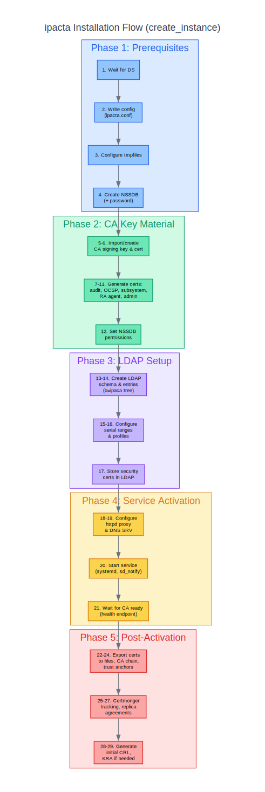

### Composition Architecture

`IpactaInstance` in `ipaserver/install/ipactainstance.py`
orchestrates installation using composition -- each aspect is handled
by a standalone helper class:

| Helper | Module | Responsibility |
|--------|--------|----------------|
| `NSSDB` | `install/db.py` | NSS database creation and management |
| `Certs` | `install/certs.py` | Certificate generation (CA, server, RA agent, subsystem, audit, OCSP) |
| `LDAPSetup` | `install/ldap_setup.py` | LDAP schema and entry creation |
| `ServiceMgmt` | `install/service_mgmt.py` | systemd service management, health checks |
| `Replication` | `install/replica.py` | Replication agreement setup |
| `KRAInstall` | `install/kra.py` | KRA installation |
| `ACME` | `install/acme.py` | ACME LDAP schema setup |
| `LWCA` | `install/lwca.py` | Lightweight CA container setup |

No helper imports from `ipaserver` -- the `_ldap_mod` function from
`service.Service` is passed as a callable to helpers that need it.

### Installation Flow (30 Steps)

The `create_instance()` method in
`ipaserver/install/ipactainstance.py` executes a 30-step installation
for a standard fresh-master install (no replica promotion, no
PKCS#12 import):

**Phase 1 -- Directory Structure and NSS Database:**
1. Create the directory structure (`/var/lib/ipacta`, `/var/lib/ipacta/ca`,
   `/var/lib/ipacta/audit`, etc.) directly via `_create_directories()`.
2. Create the NSS database with a generated password.
3. Create the service configuration (`ipacta.conf`).

**Phase 2 -- LDAP Schema and Storage (before CA cert configuration):**
4. Install the LDAP schema.
5. Initialize LDAP storage under `o=ipaca`.
6. Configure LDAP access for the `ipaca` user.

**Phase 3 -- CA Certificate and Key Material:**
7. Configure CA certificates and keys (import an existing CA signing
   key/certificate, or generate a new self-signed CA).
8. Store the CA certificate in LDAP.
9. Create the IPA CA entry.
10. Initialize the certificate storage schema.
11. Store the CA certificate in the certificate (NSS) database.

**Phase 4 -- Profiles, Sub-CA Container, and ACME (skipped when cloning):**
12. Import certificate profiles into LDAP.
13. Create the default CA ACL.
14. Create the lightweight CA container.
15. Set up the ACME service.

**Phase 5 -- Operational Certificates:**
16. Generate the server SSL certificate.
17. Generate the RA agent certificate.
18. Create the CA agent LDAP entry.
19. Verify RA key accessibility for replicas (Custodia).
20. Generate PKI subsystem certificates -- the CA subsystem, audit
    signing, OCSP signing, and `ipa-ca-agent` certificates are all
    generated together in this one step
    (`_generate_subsystem_certs`). There is no separate "admin
    certificate" step.

**Phase 6 -- Service Activation:**
21. Install certmonger renewal scripts.
22. Install the systemd service unit.
23. Configure audit logging.
24. Configure the Apache HTTP proxy.
25. Apply NSS database file permissions (near the end of the
    sequence, not early-middle).
26. Start the `ipacta.service` (systemd, `sd_notify`).

**Phase 7 -- Post-Activation:**
27. Configure certmonger for renewals.
28. Configure RA agent certificate renewal.
29. Generate the initial CRL.
30. Enable the CA instance (LDAP configuration entry, including
    `caRenewalMaster` on the initial master).

KRA installation is *not* part of this sequence. `enable_kra()` is a
separate method, independently invoked by `ipa-kra-install` after the
CA instance is already running.

### Replica Installation

Replica installation follows the same composition pattern but with
key differences:

- CA signing key and certificate are imported from the master (via
  Custodia key transport or PKCS#12).
- Replication agreement is created to replicate the `o=ipaca` suffix.
- Profiles and serial ranges are replicated automatically via LDAP.

### systemd Service

```ini
[Unit]
Description=IPA Thin CA Service
After=dirsrv.target
Wants=dirsrv.target

[Service]
Type=notify
NotifyAccess=main
User=ipaca
RuntimeDirectory=ipacta
LogsDirectory=ipacta
ExecStart=/usr/sbin/ipacta --foreground
```

The service uses `Type=notify` -- systemd considers it started only
after Gunicorn signals `READY=1` via the `when_ready` hook.

---

## Storage Architecture

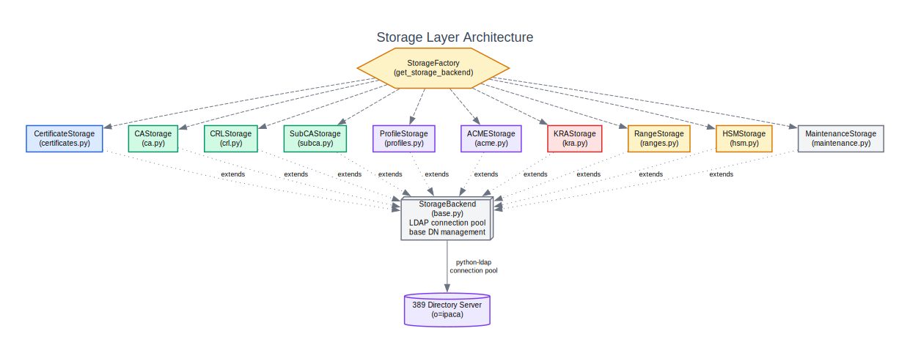

### LDAP as Sole State Store

All persistent state lives in LDAP under `o=ipaca`. This design
means:

- Multi-master replication comes for free via 389 DS replication
  agreements.
- No filesystem state to synchronize between replicas (only the NSS
  database and config file are local).
- Consistent data model across the entire topology.

### LDAP Schema Tree

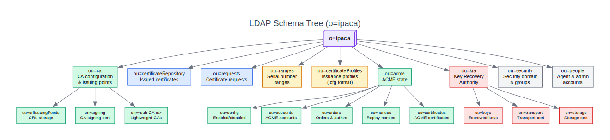

### Storage Factory

`storage/factory.py` provides a
`get_storage_backend(ca_id="ipa", random_serial_numbers=None,
config_path=None, config=None)` function that reads configuration
(random serial numbers, serial number bits, collision recovery
attempts) and constructs a `CAStorageBackend` instance. There is no
per-type backend selection -- `CAStorageBackend` is a single
composite class combining certificate, profile, CRL, sub-CA, range,
HSM, and maintenance storage via multiple inheritance. The factory
was historically a true factory that selected between `ipacta` and
`dogtag` backend implementations; the `dogtag` backend was removed,
and the function is retained for configuration abstraction and
backward compatibility.

### Storage Backends

| Backend | LDAP Location | Purpose |
|---------|---------------|---------|
| `CertificateStorage` | `ou=certificateRepository,ou=ca,o=ipaca` | Certificate CRUD, search, revoked cert queries |
| `CAStorageBackend` | `ou=ca,o=ipaca` | CA configuration, signing cert, CRL config |
| `CRLStorage` | `ou=crlIssuingPoints,ou=ca,o=ipaca` | CRL storage with caching (300s TTL) |
| `SubCAStorage` | `ou=authorities,ou=ca,o=ipaca` | Sub-CA entries (key ref, cert, config) |
| `ProfileStorage` | `ou=certificateProfiles,ou=ca,o=ipaca` | Profile CRUD, entryUSN tracking |
| `ACMEStorageBackend` | `ou=acme,o=ipaca` | Accounts, orders, authzs, challenges, nonces |
| `KRAStorageBackend` | `o=kra,o=ipaca` | Escrowed keys, transport/storage certs |
| `RangeStorage` | `ou=ranges,o=ipaca` | Serial number range allocation |
| `HSMStorage` | `cn={ca_id},cn=cas,cn=ca,o=ipaca` | HSM PKCS#11 configuration |
| `MaintenanceStorage` | (various) | Cleanup of expired entries |

### Key Storage Methods

**Certificate queries:**
- `get_revoked_for_crl()` -- Returns a generator of
  `(serial, revoked_at, reason_int)` tuples for CRL generation.
  Never loads full certificate DER, keeping memory constant.
- `get_revoked_certificates(offset, limit)` -- Paginated retrieval
  of revoked certificate records.

**CRL caching:**
- `get_crl_info()` -- Returns cached CRL metadata with a 300-second
  TTL to reduce LDAP load.

---

## FreeIPA Integration Points

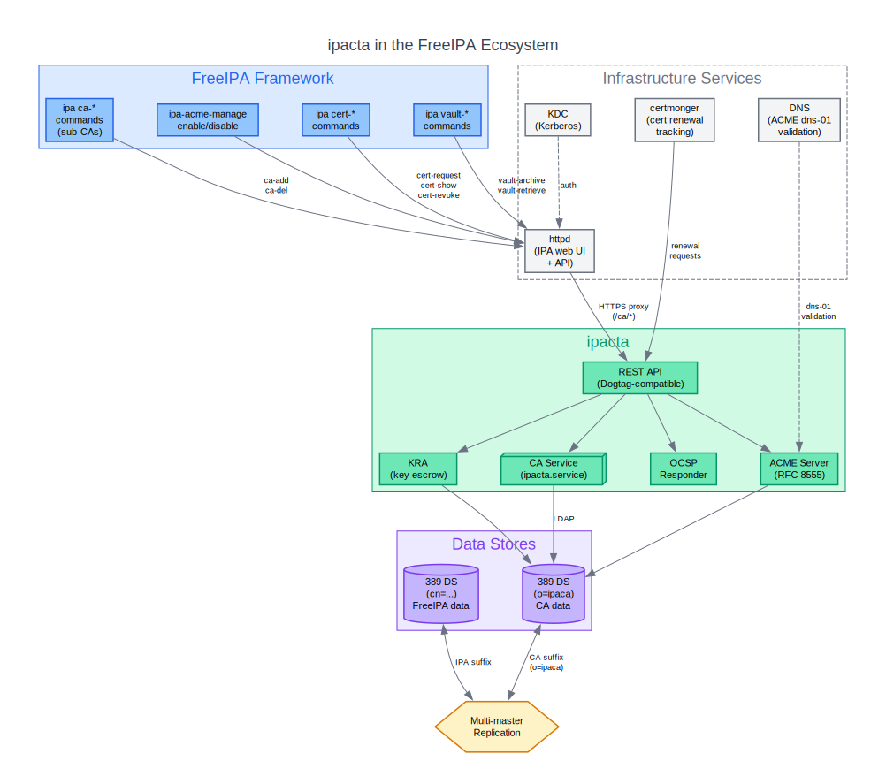

### Dogtag API Compatibility

The IPA framework (`ipaserver/plugins/dogtag.py`) communicates with
the CA through HTTPS REST calls. ipacta implements the same
endpoints Dogtag exposes, so the IPA framework does not need
modification:

| IPA Command | REST Endpoint | Description |
|-------------|---------------|-------------|
| `ipa cert-request` | `POST /ca/rest/certrequests` | Submit CSR for signing |
| `ipa cert-show` | `GET /ca/rest/certs/{serial}` | Retrieve certificate |
| `ipa cert-revoke` | `POST /ca/rest/agent/certs/{serial}/revoke` | Revoke certificate |
| `ipa cert-remove-hold` | `POST /ca/rest/agent/certs/{serial}/unrevoke` | Release from hold |
| `ipa cert-find` | `GET /ca/rest/certs` | Search certificates |
| `ipa ca-add` | `POST /ca/rest/authorities` | Create sub-CA |
| `ipa ca-del` | `DELETE /ca/rest/authorities/{id}` | Delete sub-CA |

### certmonger Integration

certmonger tracks certificate renewals by periodically checking
certificate expiry and submitting renewal requests to the CA:

- Tracking requests are configured during installation for all
  system certificates (CA signing, OCSP, audit, subsystem, httpd,
  LDAP).
- Renewal uses the same REST API endpoints as initial issuance.
- The `CertificateReloadManager` detects when tracked certificates
  are renewed and triggers service reloads.

### Vault (KRA) Integration

IPA Vault commands (`ipa vault-archive`, `ipa vault-retrieve`) use
the KRA module for key escrow:

- The vault client encrypts the secret with the KRA transport
  certificate's public key.
- The encrypted payload is sent via the REST API to the KRA storage
  backend.
- The KRA stores the secret encrypted with the storage key in LDAP.
- Retrieval reverses the process, decrypting with the storage key
  and re-wrapping with a session key for transport.

### ACME and DNS

ACME `dns-01` challenges require the client to create a DNS TXT record
at `_acme-challenge.{identifier}`. When IPA manages DNS, the ACME
client can use IPA's DNS API to create validation records
automatically.

### Replication

The `o=ipaca` LDAP suffix is replicated across all CA replicas using
389 DS multi-master replication. This means:

- Certificates issued on any replica are visible on all replicas.
- CRL numbering is consistent (monotonic counter in LDAP).
- ACME state (nonces, orders, accounts) is shared across replicas.
- Serial number ranges are allocated per-replica to avoid conflicts.

### httpd Proxy Configuration

During installation, Apache httpd is configured with a `ProxyPass`
rule to forward `/ca/*` requests to the local Gunicorn instance. The
proxy uses TLS with the RA agent certificate for client
authentication.

---

## Use Cases

### 1. Server Certificate Issuance

The most common use case: issuing TLS certificates for IPA-enrolled
hosts and services.

```
ipa cert-request --principal HTTP/server.example.com server.csr
```

Flow: Client → httpd (Kerberos auth) → REST API → `caIPAserviceCert`
profile → CA signing → LDAP storage → PEM response.

### 2. User Certificates

Issuing certificates for user authentication (e.g. smart card login):

```
ipa cert-request --principal user@EXAMPLE.COM --profile-id IECUserRoles user.csr
```

Uses the `IECUserRoles` profile with user-specific constraints and
extensions.

### 3. Sub-CA for Isolated Trust

Creating a sub-CA for a specific purpose (e.g. a department or
application) that issues certificates under its own issuer DN:

```
ipa ca-add dept-ca --subject "CN=Department CA,O=Example"
ipa cert-request --ca dept-ca --principal HTTP/app.example.com app.csr
```

The sub-CA's certificates are only trusted by systems that
specifically trust the sub-CA's signing certificate.

### 4. ACME for Automated Web Server Certificates

Automated certificate issuance for web servers using standard ACME
clients:

```
certbot certonly --server https://ipa-ca.example.com/acme/directory \
    -d webserver.example.com
```

Requires ACME to be enabled (`ipa-acme-manage enable`) and the web
server to be reachable for http-01 validation (or DNS to be
manageable for dns-01).

### 5. Vault Key Escrow

Archiving and recovering secrets (e.g. encryption keys) using IPA
Vault:

```
ipa vault-add --type symmetric my-vault
ipa vault-archive my-vault --in secret.dat
ipa vault-retrieve my-vault --out recovered.dat
```

The secret is encrypted with the KRA transport certificate, stored
encrypted with the storage key in LDAP, and can only be recovered by
authorized principals.

### 6. HSM-Backed CA for High-Security Environments

For environments requiring FIPS 140-2/3 compliance or hardware key
protection:

- Configure `pkcs11_library`, `slot_label`, and `token_pin` in the
  HSM configuration.
- The CA signing key is generated inside the HSM and never
  extracted.
- All signing operations go through the PKCS#11 interface via
  `HSMPrivateKeyProxy`.
- The HSM configuration is stored in LDAP for replication, but the
  PIN is local to each replica.

### 7. KDC PKINIT Certificates

Issuing certificates for Kerberos KDC PKINIT authentication:

```
ipa cert-request --principal krbtgt/EXAMPLE.COM@EXAMPLE.COM \
    --profile-id KDCs_PKINIT_Certs kdc.csr
```

Uses the `KDCs_PKINIT_Certs` profile with KDC-specific extensions
(id-pkinit-KPKdc extended key usage).

---

## Further Reading

The following module-level reference documents provide detailed API
documentation for each subsystem:

These files are appended after this document in the generated PDF/ODT
build (see `TeX/Makefile`), in the same order as this list, so the
links below use the resulting internal anchors and jump straight to
that appended content when read as a PDF. When read as this
standalone markdown file (e.g. on GitHub), the anchors won't resolve
to anything since the target content lives in a different file --
open the sibling file directly in this directory instead.

- [Overview](#ipacta-overview) -- Module map, exception hierarchy,
  systemd service
- [Configuration](#ipacta-configuration-reference) -- Configuration
  file format and options
- [CA Engine](#ca-engine) -- PythonCA API reference
- [Certificate Lifecycle](#certificate-and-profile-handling) --
  State machine, profiles, reload manager
- [OCSP and CRL](#ocsp-responder-and-crl-generation) -- OCSP
  responder and CRL generation details
- [ACME](#acme-server-1) -- ACME server API reference
- [Storage](#storage-backend) -- Storage backend API reference
- [REST API](#ipacta-rest-api-reference) -- REST endpoint reference
- [Security](#security-features-1) -- Audit, HSM, key encryption, key
  escrow details
- [Installation](#installation) -- Installation helper API reference
- [Utilities](#utilities) -- NSS, LDAP, X.509 utility reference
- [Sub-CA](#sub-ca-management) -- Sub-CA management reference
